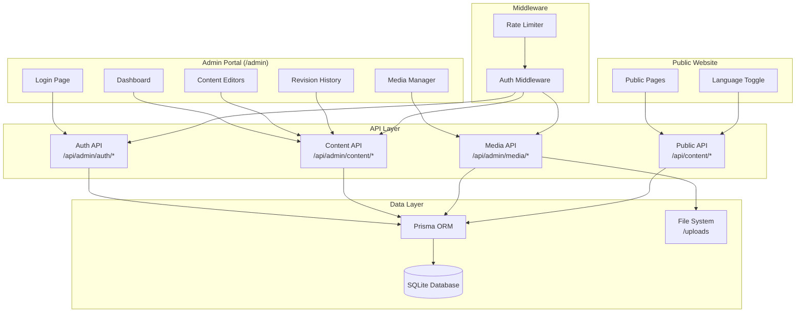

# Design Document: Admin Portal CMS

## Overview

The Admin Portal CMS is a bilingual content management system integrated into the existing Sherif Yousry Advisory Next.js website. It allows authorized administrators to manage all public-facing website content in both Arabic and English through a dedicated admin interface at `/admin`.

### Key Design Decisions

1. **Next.js App Router with Route Groups** — The admin portal uses a `(admin)` route group under `/admin` to isolate admin layouts and middleware from the public site.
2. **Database: SQLite via Prisma** — For initial deployment simplicity; the schema supports migration to PostgreSQL. Prisma ORM provides type-safe database access and migration management.
3. **Authentication: JWT with jose** — Leverages the existing `jose` library already in the project. Sessions are stateless JWT tokens stored in httpOnly cookies, validated in middleware.
4. **Rich Text Editor: Tiptap** — A headless, extensible editor that supports RTL/LTR natively and outputs JSON (storable) or HTML.
5. **File Storage: Local filesystem with `/uploads`** — Images stored on disk; metadata tracked in the database. Migrateable to S3/cloud storage later.
6. **Content API: Next.js API Routes** — RESTful API routes under `/api/admin/*` for CMS operations and `/api/content/*` for public content delivery.
7. **Bilingual Architecture** — Each content item stores both Arabic and English fields in the same database row, avoiding complex join queries.

## Architecture



### Request Flow

1. **Admin requests** → Middleware validates JWT → Route handler processes request → Prisma executes query → Response returned
2. **Public requests** → Rate limiter → `/api/content/*` handler → Prisma fetches published content → Filtered by language → Response returned
3. **Media uploads** → Auth middleware → Validate file type/size → Store on disk → Record metadata in DB → Return file URL

## Components and Interfaces

### 1. Authentication Module

```typescript
// src/lib/admin-auth.ts

interface AdminUser {
  id: string;
  email: string;
  displayName: string;
  passwordHash: string;
  role: 'super_admin' | 'admin';
  isActive: boolean;
  requiresPasswordChange: boolean;
  failedLoginAttempts: number;
  lockedUntil: Date | null;
  createdAt: Date;
  updatedAt: Date;
}

interface AdminSession {
  userId: string;
  email: string;
  role: 'super_admin' | 'admin';
  displayName: string;
  permissions: string[];
  iat: number;
  exp: number;
}

// Auth API functions
function createAdminSession(user: AdminUser): Promise<string>; // Returns JWT
function validateAdminSession(token: string): Promise<AdminSession | null>;
function hashPassword(password: string): Promise<string>;
function verifyPassword(plain: string, hash: string): Promise<boolean>;
function isAccountLocked(user: AdminUser): boolean;
function recordFailedAttempt(userId: string): Promise<void>;
function resetFailedAttempts(userId: string): Promise<void>;
```

### 2. Content Management Module

```typescript
// src/lib/content.ts

type ContentType = 'service' | 'article' | 'page_section';
type ContentStatus = 'published' | 'unpublished';

interface ContentItem {
  id: string;
  type: ContentType;
  titleAr: string;
  titleEn: string;
  bodyAr: string;
  bodyEn: string;
  status: ContentStatus;
  metadata: Record<string, unknown>; // Type-specific fields (icon, order, category, etc.)
  createdBy: string;
  updatedBy: string;
  createdAt: Date;
  updatedAt: Date;
}

interface ServiceContent extends ContentItem {
  type: 'service';
  metadata: {
    icon: string;
    displayOrder: number;
    descriptionAr: string;
    descriptionEn: string;
  };
}

interface ArticleContent extends ContentItem {
  type: 'article';
  metadata: {
    category: string;
    featuredImageId: string | null;
    publishDate: Date;
  };
}

interface PageSectionContent extends ContentItem {
  type: 'page_section';
  metadata: {
    page: string;
    sectionKey: string;
    fields: Record<string, { ar: string; en: string }>;
  };
}

// Content API functions
function createContent(data: CreateContentInput, adminId: string): Promise<ContentItem>;
function updateContent(id: string, data: UpdateContentInput, adminId: string): Promise<ContentItem>;
function getContentById(id: string): Promise<ContentItem | null>;
function listContent(filters: ContentFilters): Promise<PaginatedResult<ContentItem>>;
function searchContent(query: string, type?: ContentType): Promise<ContentItem[]>;
function deleteContent(id: string): Promise<void>;
```

### 3. Revision History Module

```typescript
// src/lib/revisions.ts

interface ContentRevision {
  id: string;
  contentId: string;
  revisionNumber: number;
  previousState: Record<string, unknown>; // Full snapshot of all fields
  changedFields: string[];
  changedBy: string;
  createdAt: Date;
}

function createRevision(contentId: string, previousState: ContentItem, changedBy: string): Promise<ContentRevision>;
function getRevisions(contentId: string, page: number): Promise<PaginatedResult<ContentRevision>>;
function restoreRevision(revisionId: string, adminId: string): Promise<ContentItem>;
function pruneOldRevisions(contentId: string, maxRevisions: number): Promise<void>;
```

### 4. Media Management Module

```typescript
// src/lib/media.ts

interface MediaItem {
  id: string;
  fileName: string;
  originalName: string;
  filePath: string;
  mimeType: 'image/jpeg' | 'image/png' | 'image/webp';
  fileSize: number; // bytes
  width: number;
  height: number;
  uploadedBy: string;
  uploadedAt: Date;
}

interface MediaReference {
  mediaId: string;
  contentId: string;
  fieldName: string;
}

function uploadMedia(file: File, adminId: string): Promise<MediaItem>;
function deleteMedia(id: string, force: boolean): Promise<{ deleted: boolean; references?: MediaReference[] }>;
function listMedia(page: number): Promise<PaginatedResult<MediaItem>>;
function getMediaReferences(mediaId: string): Promise<MediaReference[]>;
function validateMediaFile(file: File): { valid: boolean; error?: string };
```

### 5. Public Content Delivery Module

```typescript
// src/lib/public-content.ts

type Language = 'ar' | 'en';

interface PublicContentResponse {
  id: string;
  title: string;
  body: string;
  metadata: Record<string, unknown>;
  updatedAt: Date;
}

function getPublishedServices(lang: Language): Promise<PublicContentResponse[]>;
function getPublishedArticles(lang: Language, page: number, category?: string): Promise<PaginatedResult<PublicContentResponse>>;
function getPageSection(page: string, sectionKey: string, lang: Language): Promise<PublicContentResponse | null>;
function resolveLanguageFallback(item: ContentItem, lang: Language): PublicContentResponse;
```

### 6. Admin UI Components

```
src/app/admin/
├── layout.tsx              # Admin shell: sidebar + header
├── login/page.tsx          # Login form
├── page.tsx                # Dashboard
├── services/
│   ├── page.tsx            # Service list
│   ├── new/page.tsx        # Create service
│   └── [id]/edit/page.tsx  # Edit service
├── articles/
│   ├── page.tsx            # Article list
│   ├── new/page.tsx        # Create article
│   └── [id]/edit/page.tsx  # Edit article
├── sections/
│   ├── page.tsx            # Page sections list
│   └── [id]/edit/page.tsx  # Edit section
├── media/page.tsx          # Media gallery
├── administrators/
│   ├── page.tsx            # Admin list
│   └── new/page.tsx        # Create admin
└── components/
    ├── BilingualEditor.tsx  # Side-by-side AR/EN editor
    ├── RichTextEditor.tsx   # Tiptap editor wrapper
    ├── MediaPicker.tsx      # Image selection dialog
    ├── ContentPreview.tsx   # Preview rendering
    ├── RevisionHistory.tsx  # Revision timeline
    └── AdminSidebar.tsx     # Navigation sidebar
```

## Data Models

### Prisma Schema

```prisma
// prisma/schema.prisma

datasource db {
  provider = "sqlite"
  url      = env("DATABASE_URL")
}

generator client {
  provider = "prisma-client-js"
}

model AdminUser {
  id                     String    @id @default(cuid())
  email                  String    @unique
  displayName            String
  passwordHash           String
  role                   String    @default("admin") // "super_admin" | "admin"
  isActive               Boolean   @default(true)
  requiresPasswordChange Boolean   @default(true)
  failedLoginAttempts    Int       @default(0)
  lockedUntil            DateTime?
  createdAt              DateTime  @default(now())
  updatedAt              DateTime  @updatedAt

  createdContent  ContentItem[]    @relation("CreatedBy")
  updatedContent  ContentItem[]    @relation("UpdatedBy")
  revisions       ContentRevision[]
  uploadedMedia   MediaItem[]
}

model ContentItem {
  id         String   @id @default(cuid())
  type       String   // "service" | "article" | "page_section"
  titleAr    String
  titleEn    String
  bodyAr     String
  bodyEn     String
  status     String   @default("unpublished") // "published" | "unpublished"
  metadata   String   @default("{}") // JSON string for type-specific fields
  
  createdById String
  updatedById String
  createdBy   AdminUser @relation("CreatedBy", fields: [createdById], references: [id])
  updatedBy   AdminUser @relation("UpdatedBy", fields: [updatedById], references: [id])
  
  createdAt  DateTime @default(now())
  updatedAt  DateTime @updatedAt

  revisions      ContentRevision[]
  mediaReferences MediaReference[]

  @@index([type, status])
  @@index([updatedAt])
}

model ContentRevision {
  id              String   @id @default(cuid())
  contentId       String
  content         ContentItem @relation(fields: [contentId], references: [id], onDelete: Cascade)
  revisionNumber  Int
  previousState   String   // JSON snapshot of all fields
  changedFields   String   // JSON array of field names
  changedById     String
  changedBy       AdminUser @relation(fields: [changedById], references: [id])
  createdAt       DateTime @default(now())

  @@index([contentId, createdAt])
  @@unique([contentId, revisionNumber])
}

model MediaItem {
  id           String   @id @default(cuid())
  fileName     String   @unique
  originalName String
  filePath     String
  mimeType     String
  fileSize     Int
  width        Int
  height       Int
  uploadedById String
  uploadedBy   AdminUser @relation(fields: [uploadedById], references: [id])
  uploadedAt   DateTime @default(now())

  references MediaReference[]
}

model MediaReference {
  id        String      @id @default(cuid())
  mediaId   String
  media     MediaItem   @relation(fields: [mediaId], references: [id], onDelete: Cascade)
  contentId String
  content   ContentItem @relation(fields: [contentId], references: [id], onDelete: Cascade)
  fieldName String

  @@unique([mediaId, contentId, fieldName])
}
```

### API Routes Structure

| Route | Method | Description |
|-------|--------|-------------|
| `/api/admin/auth/login` | POST | Admin login |
| `/api/admin/auth/logout` | POST | Admin logout |
| `/api/admin/auth/change-password` | POST | Change password |
| `/api/admin/users` | GET, POST | List/create admin users |
| `/api/admin/users/[id]` | PATCH, DELETE | Update/deactivate admin |
| `/api/admin/content` | GET, POST | List/create content |
| `/api/admin/content/[id]` | GET, PATCH, DELETE | Get/update/delete content |
| `/api/admin/content/[id]/revisions` | GET | List revisions |
| `/api/admin/content/[id]/revisions/[revId]/restore` | POST | Restore revision |
| `/api/admin/media` | GET, POST | List/upload media |
| `/api/admin/media/[id]` | DELETE | Delete media |
| `/api/content/services` | GET | Public: get services |
| `/api/content/articles` | GET | Public: get articles |
| `/api/content/sections/[page]/[key]` | GET | Public: get page section |


## Correctness Properties

*A property is a characteristic or behavior that should hold true across all valid executions of a system — essentially, a formal statement about what the system should do. Properties serve as the bridge between human-readable specifications and machine-verifiable correctness guarantees.*

### Property 1: Invalid credentials always produce a generic error

*For any* combination of email and password where at least one is incorrect, the authentication endpoint SHALL return the same generic error message regardless of which field was wrong (nonexistent email, wrong password, or both).

**Validates: Requirements 1.3**

### Property 2: Unauthenticated access to admin routes always redirects

*For any* valid admin route path (matching `/admin/*` or `/api/admin/*`), a request without a valid session token SHALL result in a redirect to the login page.

**Validates: Requirements 1.6**

### Property 3: Password validation accepts only compliant passwords

*For any* string, the password validator SHALL accept it if and only if it contains between 8 and 128 characters and includes at least one uppercase letter, one lowercase letter, and one digit.

**Validates: Requirements 2.4**

### Property 4: Content search returns only matching results

*For any* search query of at least 2 characters and any set of content items, every item returned by the search function SHALL contain the search term (case-insensitive) in either its Arabic title or its English title.

**Validates: Requirements 3.4**

### Property 5: Content field validation enforces bilingual requirements

*For any* content item submission, the validator SHALL accept it if and only if both Arabic and English titles contain between 2 and 200 non-whitespace characters, and both Arabic and English body fields contain at least 1 non-whitespace character.

**Validates: Requirements 4.2, 4.7**

### Property 6: Bilingual content round trip

*For any* valid content item with arbitrary Arabic and English text in all fields, saving the item and then retrieving it by ID SHALL produce an item with identical Arabic and English field values.

**Validates: Requirements 4.3**

### Property 7: Services are sorted by display order with creation date tiebreaker

*For any* set of published services, the public content API SHALL return them sorted by display order in ascending numeric order, and for services with equal display order, sorted by creation date in ascending order (oldest first).

**Validates: Requirements 5.2, 5.4**

### Property 8: Unpublished services are excluded from public delivery

*For any* set of services with mixed published/unpublished status, the public services endpoint SHALL return only services with status set to "published", and no unpublished service SHALL appear in the results.

**Validates: Requirements 5.3**

### Property 9: Published content visibility filters by status and date

*For any* set of articles with mixed statuses and publish dates, the public content API SHALL return only articles that have status "published" AND a publish date equal to or earlier than the current server time.

**Validates: Requirements 6.4, 6.5, 9.4**

### Property 10: Article category filter returns only matching articles

*For any* category filter value and any set of published articles, all articles returned by the category-filtered query SHALL have that exact category assigned.

**Validates: Requirements 6.6**

### Property 11: Paginated list invariants

*For any* paginated content list request (content items, articles, or media), the response SHALL contain at most the configured page size (20 items), items SHALL be sorted by the specified ordering field, and the total count SHALL equal the number of items matching the applied filters.

**Validates: Requirements 3.3, 6.7, 8.4**

### Property 12: Page section field validation

*For any* page section save request, the validator SHALL accept text field values if and only if they contain between 1 and 2000 characters.

**Validates: Requirements 7.3**

### Property 13: Media file validation

*For any* file upload, the media validator SHALL accept the file if and only if its MIME type is one of `image/jpeg`, `image/png`, or `image/webp` AND its size is at most 5,242,880 bytes (5 MB).

**Validates: Requirements 8.1, 8.2**

### Property 14: Media reference detection is complete

*For any* media item, the reference detection function SHALL return all content items that reference that media item, with no false positives (items that don't reference it) and no false negatives (items that do reference it but are missing from results).

**Validates: Requirements 8.6**

### Property 15: Language-specific content delivery

*For any* content item with both Arabic and English translations, requesting content with language "ar" SHALL return the Arabic field values, and requesting with language "en" SHALL return the English field values.

**Validates: Requirements 9.1, 9.2**

### Property 16: Language fallback for missing translations

*For any* content item where the requested language field is empty or missing, the content delivery function SHALL return the alternative language version instead.

**Validates: Requirements 9.6**

### Property 17: Revision creation captures complete previous state

*For any* content item update, the system SHALL create a revision record containing the complete previous content state (all fields), and the number of revisions per content item SHALL never exceed 50 (oldest discarded when limit exceeded).

**Validates: Requirements 10.1**

### Property 18: Changed fields detection is accurate

*For any* two content states (previous revision and current), the changed fields list SHALL contain exactly the field names whose values differ between the two states — no more, no less.

**Validates: Requirements 10.2**

### Property 19: Revision restoration is reversible

*For any* content item with at least one revision, restoring a previous revision SHALL: (a) set the current content state to the revision's stored content, and (b) create a new revision capturing the pre-restoration state, making the restore itself reversible.

**Validates: Requirements 10.4**

## Error Handling

### Authentication Errors

| Scenario | HTTP Status | Response | User Experience |
|----------|-------------|----------|-----------------|
| Invalid credentials | 401 | Generic error message (same for wrong email/password) | Form shows "بيانات غير صحيحة / Invalid credentials" |
| Account locked | 423 | Lock duration message | "الحساب مقفل مؤقتاً / Account temporarily locked" |
| Session expired | 401 | Redirect trigger | Auto-redirect to login with return URL |
| Insufficient permissions | 403 | Permission denied | "غير مصرح / Access denied" |

### Content API Errors

| Scenario | HTTP Status | Response | Recovery |
|----------|-------------|----------|----------|
| Validation failure | 400 | Field-specific error messages | Form preserves input, highlights invalid fields |
| Content not found | 404 | Not found message | Redirect to content list |
| Database error on save | 500 | Generic server error | Form preserves all input, retry button shown |
| Concurrent edit conflict | 409 | Conflict notification | Show diff, allow merge or overwrite |
| Revision restore failure | 500 | Restore failed message | Current state preserved unchanged |

### Media Upload Errors

| Scenario | HTTP Status | Response | Recovery |
|----------|-------------|----------|----------|
| Invalid file type | 400 | Allowed types listed | Upload dialog remains open |
| File too large | 400 | Size limit shown | Upload dialog remains open |
| Storage write failure | 500 | Server error | Retry button, no partial files left |
| Referenced image deletion | 409 | Reference list + confirmation | User chooses to confirm or cancel |

### Public Content Delivery Errors

| Scenario | HTTP Status | Response | Recovery |
|----------|-------------|----------|----------|
| Content not found | 404 | Graceful empty state | Show "content unavailable" in visitor's language |
| Missing translation | 200 | Fallback language content | Render alternative language with indicator |
| API timeout | 504 | Cached/fallback content | Serve stale cache if available |

### Error Design Principles

1. **Never expose internals** — Error messages shown to users never include stack traces, SQL queries, or internal paths
2. **Preserve user work** — All form errors retain entered data; the user never loses work due to a server error
3. **Bilingual errors** — All error messages are provided in both Arabic and English, rendered based on the admin's UI language preference
4. **Audit trail** — All errors (especially auth failures) are logged with timestamp, IP, and user identifier for security monitoring

## Testing Strategy

### Unit Tests

Unit tests cover specific examples, edge cases, and component behavior:

- **Authentication**: Login flow, session creation/validation, account lockout after 5 attempts, password change flow, logout
- **Validation**: Title/body length boundaries, password rule enforcement, email format, media file type/size checks
- **Content CRUD**: Create, read, update, delete operations for each content type
- **Revision Logic**: Revision creation on update, max 50 cap, restore flow, changed fields detection
- **Media Management**: Upload metadata recording, reference tracking, deletion with/without references
- **Public API**: Language selection, default language, pagination boundaries, empty results
- **Admin UI Components**: Sidebar rendering, form pre-fill, editor directionality, preview rendering

### Property-Based Tests

Property-based tests verify universal correctness properties across randomized inputs. The project will use **fast-check** as the property-based testing library for TypeScript.

**Configuration:**
- Minimum 100 iterations per property test
- Each test tagged with: `Feature: admin-portal-cms, Property {N}: {title}`

**Properties to implement (from Correctness Properties section):**
1. Invalid credentials → generic error (Property 1)
2. Unauthenticated route access → redirect (Property 2)
3. Password validation compliance (Property 3)
4. Content search returns matching results only (Property 4)
5. Content field bilingual validation (Property 5)
6. Bilingual content save/retrieve round trip (Property 6)
7. Service sorting with tiebreaker (Property 7)
8. Unpublished services excluded (Property 8)
9. Published content visibility by status + date (Property 9)
10. Article category filter correctness (Property 10)
11. Paginated list invariants (Property 11)
12. Page section field validation (Property 12)
13. Media file validation (Property 13)
14. Media reference detection completeness (Property 14)
15. Language-specific content delivery (Property 15)
16. Language fallback for missing translations (Property 16)
17. Revision captures complete previous state (Property 17)
18. Changed fields detection accuracy (Property 18)
19. Revision restoration reversibility (Property 19)

### Integration Tests

Integration tests verify end-to-end flows with real database interactions:

- **Auth flow**: Login → session → protected route access → logout
- **Content lifecycle**: Create → edit → publish → verify on public API → unpublish
- **Media flow**: Upload → attach to content → delete with reference warning → force delete
- **Revision flow**: Edit content 3 times → view history → restore revision → verify new revision created
- **Public delivery**: Create bilingual content → request in each language → verify correct language returned
- **Admin management**: Create admin → force password change → deactivate → verify session invalidation

### Test Infrastructure

- **Framework**: Jest (or Vitest for faster execution) with `@testing-library/react` for component tests
- **PBT Library**: fast-check
- **Database**: In-memory SQLite for unit/property tests, test database for integration tests
- **Mocking**: Prisma client mocking for unit tests; real DB for integration tests
- **API Testing**: Supertest or Next.js test utilities for route handler testing
