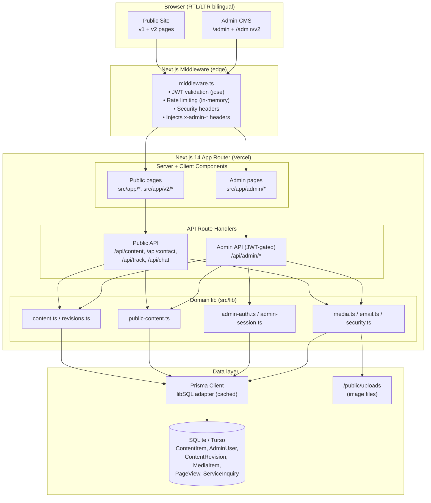
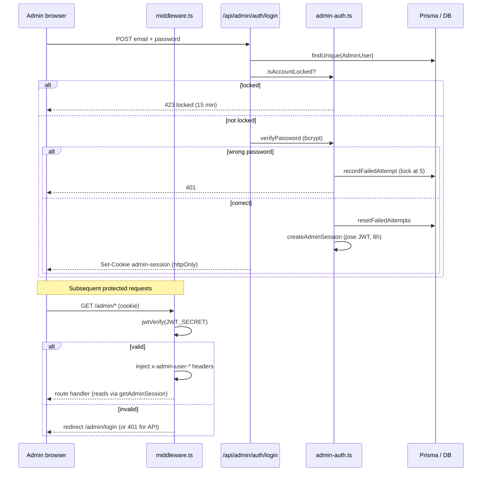
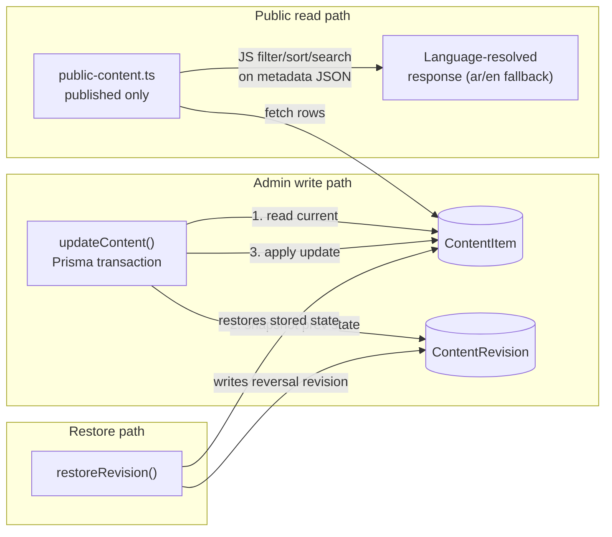
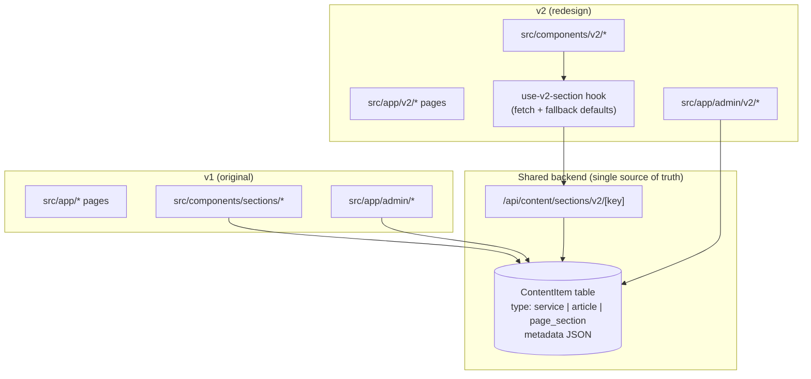
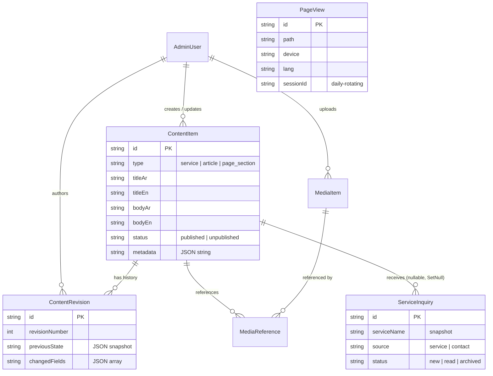

# System Architecture — Sherif Yousry Advisory

A bilingual (Arabic/English) Next.js 14 App Router site with a custom, JWT-secured
admin CMS. Content lives in a single generic table with full revision history, and a
parallel "v2" redesign of both the public site and the admin runs alongside the
originals.

> Diagrams use [Mermaid](https://mermaid.js.org/). They render in GitHub, most IDE
> Markdown previews, and any Mermaid-compatible viewer.

---

## Tech stack

- **Next.js 14.2** (App Router), React 18.3, TypeScript 5.6
- **Prisma 7.9** via the **libSQL adapter** (Turso in prod, local SQLite file in dev)
- **Auth**: `jose` (JWT) + `bcryptjs` — custom session, not NextAuth
- **UI**: Tailwind, Framer Motion, lucide-react, TipTap rich-text editor, Recharts
- **Testing**: Vitest + Testing Library + fast-check + jsdom

---

## High-level system architecture

Notes:

- The **middleware is the single gate** for all `/admin` and `/api/admin` traffic;
  route handlers trust the injected `x-admin-*` headers rather than re-validating the JWT.
- **v1 and v2 share the same backend and database** — only pages/components differ.

---

## Admin authentication flow

---

## Content model + revision flow

---

## The v1 / v2 parallel structure

---

## Data model (entity relationships)

---

## Architectural risks worth tracking

1. **Builds ignore all type and lint errors** — `next.config.js` sets
   `typescript.ignoreBuildErrors` and `eslint.ignoreDuringBuilds` to `true`.
2. **JSON-string `metadata` defeats SQL** — public reads fetch all rows then
   filter/sort/search in JS. Won't scale; can't be indexed.
3. **In-memory rate limiting** — doesn't survive across serverless instances;
   Redis is the intended prod fix.
4. **Dual DB env vars** — runtime reads `TURSO_DATABASE_URL`, migrations read
   `DATABASE_URL`. Works locally because both point to the same file, but it's a footgun.
5. **v1/v2 duplication** — nearly every component/admin page exists twice; needs a
   cutover plan so v1 can be removed.
